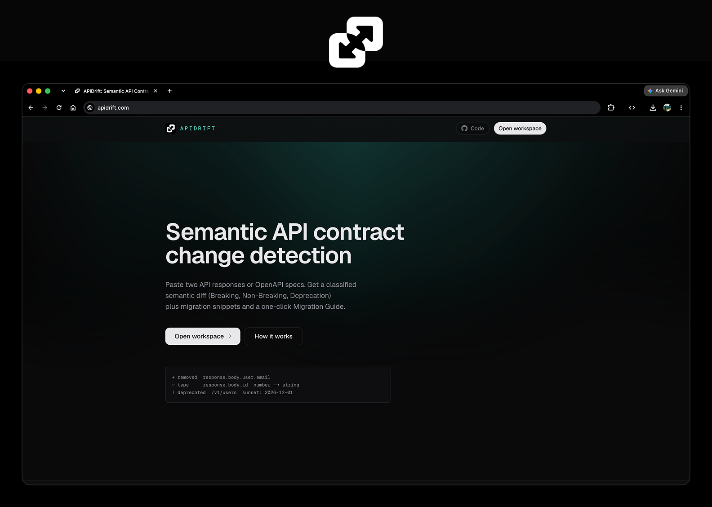
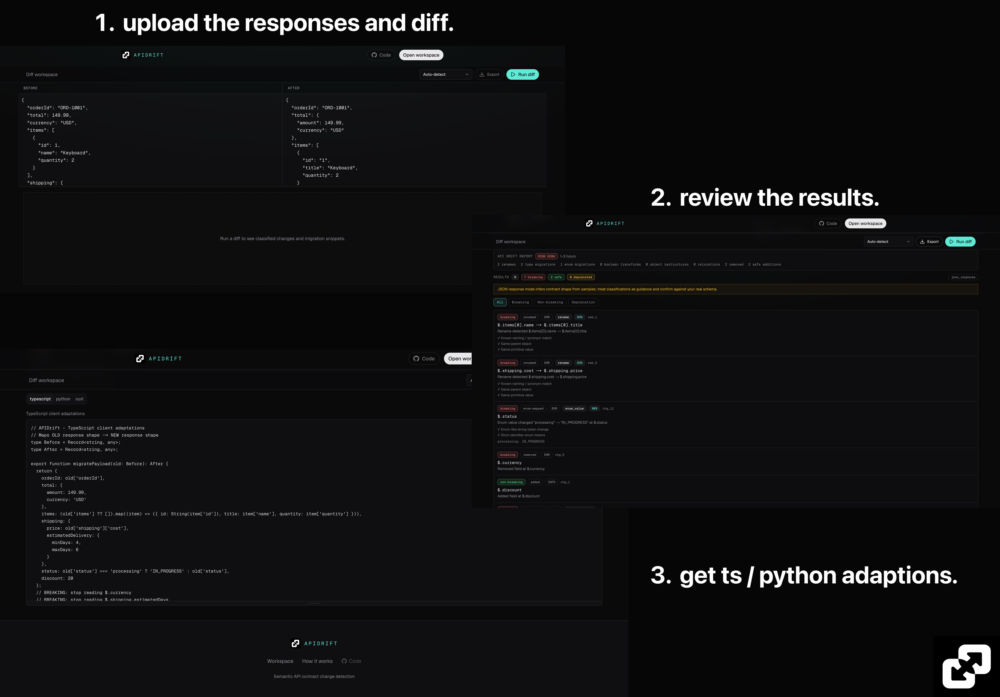
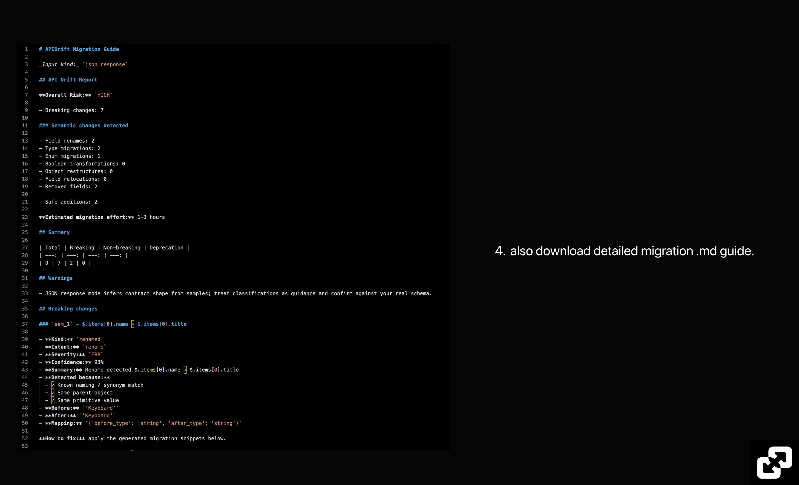

<p align="center">
  
</p>

<h1 align="center">APIDrift</h1>

<p align="center">
  <strong>Semantic API contract change detection</strong><br />
  Paste two responses or OpenAPI specs. Get a classified drift report, migration adapters, and a downloadable guide.
</p>

<p align="center">
  <a href="https://github.com/abdull-ah-med/apidrift/actions/workflows/ci.yml"></a>
  <a href="https://github.com/abdull-ah-med/apidrift"></a>
</p>

<p align="center">
  <a href="#how-it-works">How it works</a> ·
  <a href="#run-locally">Run locally</a> ·
  <a href="#stack">Stack</a>
</p>

<p align="center">
  
</p>

## Why APIDrift

Structural diffs tell you a field disappeared. They do not tell you that `isPaid` became `paymentStatus`, that customer fields moved under `customer`, or that line items need a `.map()`.

APIDrift correlates removes and adds into renames, relocations, type migrations, boolean→enum transforms, and object restructures. Then it emits TypeScript and Python adapters shaped like the new contract, plus a markdown Migration Guide you can drop into a PR.

## How it works

### 1. Paste before and after

Open the workspace, load JSON responses or OpenAPI specs (or use Auto-detect), and run the diff.

<p align="center">
  
</p>

You get:

- An **API Drift Report** with overall risk and estimated effort
- Semantic findings: renames, type adaptations, enum transforms, object restructures, removals, safe additions
- Per-change confidence and detection reasons (synonym match, same value, same parent, and more)
- Client adapters in **TypeScript**, **Python**, and a **cURL** checklist

### 2. Export the Migration Guide

Download a markdown guide with risk, semantic counts, warnings, and every change with confidence, reasons, and before/after samples.

<p align="center">
  
</p>

## What the engine detects

| Signal | Example |
|--------|---------|
| Field rename | `shipping.cost` → `shipping.price` |
| Nested relocate + rename | `customerName` → `customer.fullName` |
| Type migration | `id: 123` → `userId: "123"` |
| Boolean → enum | `isPaid: true` → `paymentStatus: "PAID"` |
| Enum value remap | `"processing"` → `"IN_PROGRESS"` |
| Object rename | `shippingAddress` → `deliveryAddress` |
| Array item schema | `items[].name` → `items[].title` with `.map()` adapters |
| Safe addition | New optional fields classified non-breaking |

Migrations prefer a complete old→new adapter: unchanged fields are kept, arrays use `.map()` / list comprehensions, and deprecated fields are dropped.

## Run locally

**Prerequisites:** Node.js 20.9+, pnpm 10+, Python 3.12+, [uv](https://docs.astral.sh/uv/)

```bash
pnpm install
cd apps/api && uv sync && cd ../..
```

```bash
# terminal 1
pnpm dev:api

# terminal 2
pnpm dev:web
```

| Surface | URL |
|---------|-----|
| Landing | http://localhost:3000 |
| Workspace | http://localhost:3000/app |
| API health | http://127.0.0.1:8000/health |

Browser calls use `/backend/*`, rewritten to FastAPI on port 8000.

On networks where Node hangs on IPv6:

```bash
export NODE_OPTIONS="--dns-result-order=ipv4first --no-network-family-autoselection"
```

## Project layout

```text
apps/web      Next.js App Router UI
apps/api      FastAPI semantic diff engine
examples/     JSON + OpenAPI fixtures
```

## Stack

| Layer | Tech |
|-------|------|
| Web | Next.js App Router, React, Tailwind CSS, shadcn/ui |
| API | FastAPI, Pydantic, deepdiff, openapi-spec-validator |

## Tests

```bash
pnpm test:api
pnpm test:e2e
```

CI on [GitHub Actions](https://github.com/abdull-ah-med/apidrift/actions) runs API pytest, web lint + build, and Playwright e2e on every push and pull request to `main`.

## License

See [LICENSE](LICENSE).
